<div align="center">
  
</div>

<div align="center">
  <a href="https://git.io/typing-svg"></a>
</div>

<div align="center">
  
</div>

<br/>

<div align="center">
  <a href="https://linkedin.com/in/thrinadh2164"></a>&nbsp;
  <a href="mailto:thrinadh2164.work@gmail.com"></a>&nbsp;
  <a href="https://thrinadh.dev"></a>
</div>

<br/>

<div align="center">
  
</div>

## 「 About Me 」

```javascript
const thrinadh = {
    alias:    "thrinadh.dev",
    role:     "Full-Stack & Generative AI Engineer",
    degree:   "BE CSE (AI & ML) Graduate",
    focus:    ["Generative AI", "RAG Pipelines", "Multi-Agent Systems"],
    building: "Autonomous AI Workflows & Android Apps",
    learning: ["LLMs", "Agentic Architectures", "MLOps"],
    funFact:  "I automate everything — even my GitHub profile 🔥"
};
```

- 🔥 Currently building **AI-Powered Applications**
- 🤖 Exploring **LLMs, RAG Pipelines & Agentic AI**
- 📱 Building **Android & Full-Stack** projects
- ⚡ Ask me about **Full-Stack, Android, AI/ML**

<br clear="both"/>

<div align="center">
  
</div>

## 「 Technologies 」

<table border="0" cellspacing="12" cellpadding="0" align="center">
<tr>

<td width="420" valign="top" align="center">

<h3>⚡ Languages</h3>
<br>

<table align="center" cellspacing="0" cellpadding="10">
  <tr>
    <td align="center"><br/><sub><b>Python</b></sub></td>
    <td align="center"><br/><sub><b>JavaScript</b></sub></td>
    <td align="center"><br/><sub><b>Java</b></sub></td>
    <td align="center"><br/><sub><b>C++</b></sub></td>
  </tr>
  <tr>
    <td align="center"><br/><sub><b>HTML5</b></sub></td>
    <td align="center"><br/><sub><b>CSS3</b></sub></td>
    <td align="center"><br/><sub><b>SQL</b></sub></td>
    <td align="center"><br/><sub><b>Kotlin</b></sub></td>
  </tr>
</table>

</td>

<td width="420" valign="top" align="center">

<h3>🔥 Frameworks &amp; Tools</h3>
<br>

<table align="center" cellspacing="0" cellpadding="10">
  <tr>
    <td align="center"><br/><sub><b>React</b></sub></td>
    <td align="center"><br/><sub><b>Node.js</b></sub></td>
    <td align="center"><br/><sub><b>Android</b></sub></td>
    <td align="center"><br/><sub><b>Firebase</b></sub></td>
  </tr>
  <tr>
    <td align="center"><br/><sub><b>TensorFlow</b></sub></td>
    <td align="center"><br/><sub><b>PyTorch</b></sub></td>
    <td align="center"><br/><sub><b>Docker</b></sub></td>
    <td align="center"><br/><sub><b>GCP</b></sub></td>
  </tr>
</table>

</td>

</tr>
</table>

<div align="center">
  
</div>

## 「 Portfolio Showcase 」

<table width="100%" border="0" cellspacing="12" cellpadding="0">
<tr>
  <td width="33.3%" valign="top" align="center"><a href="https://github.com/thrinadh2164?tab=repositories"></a></td>
  <td width="33.3%" valign="top" align="center"><a href="https://thrinadh2164.github.io/My_Awards/"></a></td>
  <td width="33.3%" valign="top" align="center"><a href="https://thrinadh2164.github.io/My_Certifications/"></a></td>
</tr>
</table>

<div align="center">
  
</div>

## 「 GitHub Stats 」

<div align="center">
  
</div>

<br/>

<div align="center">
  
</div>

<div align="center">
  
</div>

<div align="center">
  <a href="./docs/COLLAB.md"></a>
</div>

<br/>

<div align="center">
  <a href="https://thrinadh.dev"></a>&nbsp;&nbsp;
  <a href="mailto:thrinadh2164.work@gmail.com"></a>&nbsp;&nbsp;
  <a href="https://linkedin.com/in/thrinadh2164"></a>
</div>

<div align="center">
  
</div>
