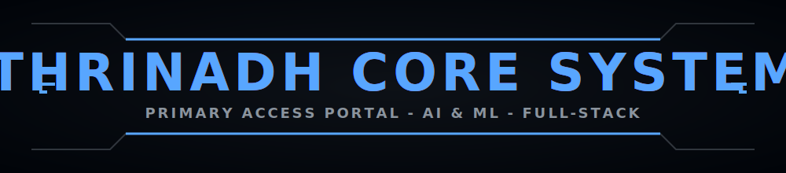
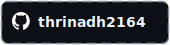
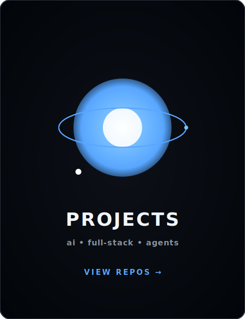
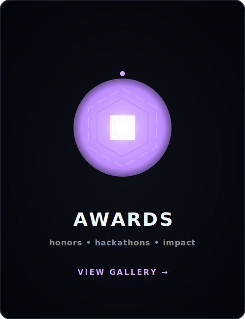
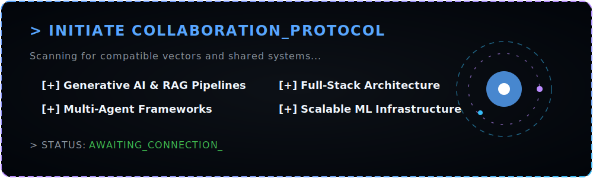

<div align="center">
  
</div>

<div align="center">
  <a href="https://git.io/typing-svg"></a>
</div>

<br/>

<div align="center">
  <a href="https://linkedin.com/in/thrinadh2164"></a>&nbsp;
  <a href="mailto:thrinadh2164.work@gmail.com"></a>&nbsp;
  <a href="https://thrinadh.dev"></a>&nbsp;
  <a href="https://github.com/thrinadh2164"></a>
</div>

<br/>

<div align="center">
  
</div>

## 「 About Me 」

```javascript
const thrinadh = {
    alias:       "thrinadh.dev",
    role:        "Full-Stack & AI/ML Engineer",
    education:   "BE CSE (AI & ML) Graduate",
    focus:       ["Generative AI", "RAG Pipelines", "Multi-Agent Systems"],
    building:    "AI-Powered Applications & Android Apps",
    learning:    ["LLMs", "Agentic AI", "MLOps"],
    funFact:     "I automate everything — even my GitHub profile 🔥"
};
```

<br clear="both"/>

<div align="center">
  
</div>

## 「 Technologies 」

<table border="0" cellspacing="12" cellpadding="0" align="center">
<tr>

<!-- LEFT: Languages -->
<td width="420" valign="top" align="center">

<h3>⚡ Languages</h3>
<br>

<table align="center" cellspacing="0" cellpadding="10">
  <tr>
    <td align="center"><br/><sub>Python</sub></td>
    <td align="center"><br/><sub>JavaScript</sub></td>
    <td align="center"><br/><sub>Java</sub></td>
    <td align="center"><br/><sub>C++</sub></td>
  </tr>
  <tr>
    <td align="center"><br/><sub>HTML5</sub></td>
    <td align="center"><br/><sub>CSS3</sub></td>
    <td align="center"><br/><sub>SQL</sub></td>
    <td align="center"><br/><sub>Kotlin</sub></td>
  </tr>
</table>

</td>

<!-- RIGHT: Frameworks & Tools -->
<td width="420" valign="top" align="center">

<h3>🔥 Frameworks &amp; Tools</h3>
<br>

<table align="center" cellspacing="0" cellpadding="10">
  <tr>
    <td align="center"><br/><sub>React</sub></td>
    <td align="center"><br/><sub>Node.js</sub></td>
    <td align="center"><br/><sub>Android</sub></td>
    <td align="center"><br/><sub>Firebase</sub></td>
  </tr>
  <tr>
    <td align="center"><br/><sub>TensorFlow</sub></td>
    <td align="center"><br/><sub>PyTorch</sub></td>
    <td align="center"><sub>Docker</sub></td>
    <td align="center"><br/><sub>GCP / Gemini</sub></td>
  </tr>
</table>

</td>

</tr>
</table>

<div align="center">
  
</div>

## 「 Portfolio Showcase 」

<table width="100%" border="0" cellspacing="12" cellpadding="0">
<tr>
  <td width="33.3%" valign="top" align="center"><a href="https://github.com/thrinadh2164?tab=repositories"></a></td>
  <td width="33.3%" valign="top" align="center"><a href="https://thrinadh2164.github.io/My_Awards/"></a></td>
  <td width="33.3%" valign="top" align="center"><a href="https://thrinadh2164.github.io/My_Certifications/"></a></td>
</tr>
</table>

<div align="center">
  
</div>

## 「 GitHub Stats 」

<div align="center">
  
</div>

<br/>

<div align="center">
  
</div>

<div align="center">
  
</div>

<div align="center">
  <a href="./docs/COLLAB.md"></a>
</div>

<br/>

<div align="center">
  <a href="https://thrinadh.dev"></a>&nbsp;&nbsp;
  <a href="mailto:thrinadh2164.work@gmail.com"></a>&nbsp;&nbsp;
  <a href="https://linkedin.com/in/thrinadh2164"></a>
</div>

<div align="center">
  
</div>
